# 记录
* 多标签分类：
    * [激活函数的选择](https://zhuanlan.zhihu.com/p/500347063)
    * [损失函数的选择](https://www.zhihu.com/question/358811772)
    
# 类型
1. scab 癣病
    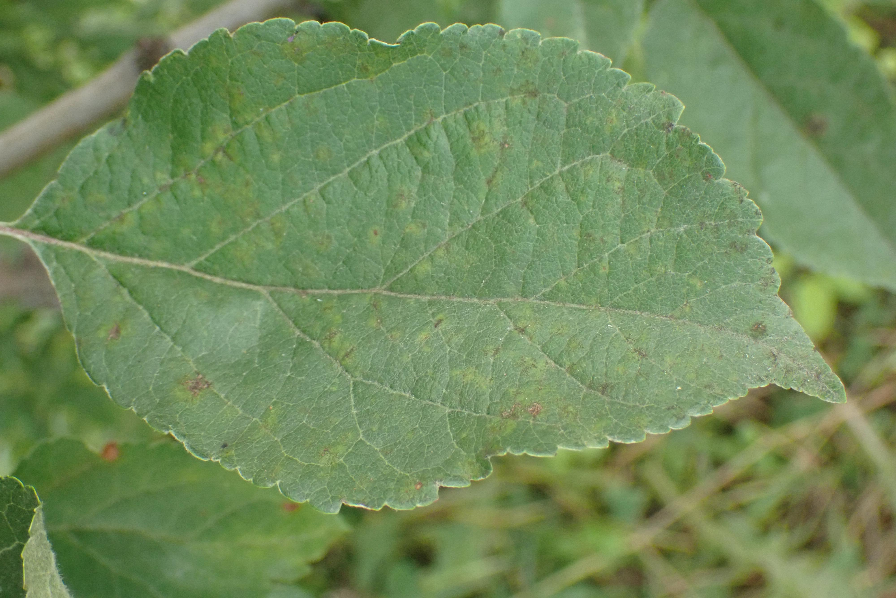
2. powdery_mildew 白粉病
    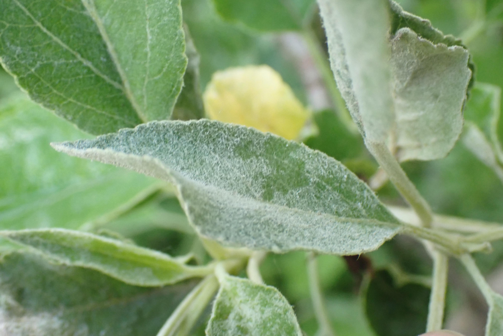
3. healthy 健康
    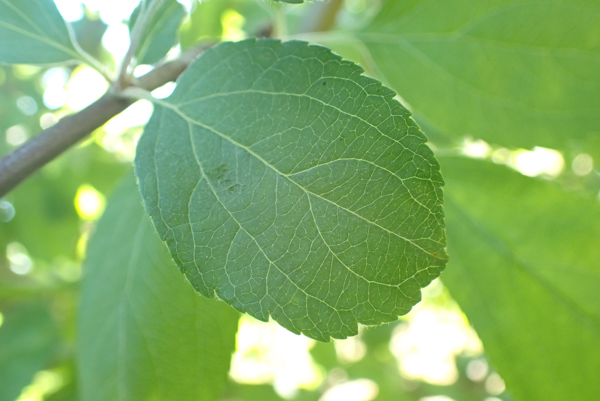
4. rush 锈病
    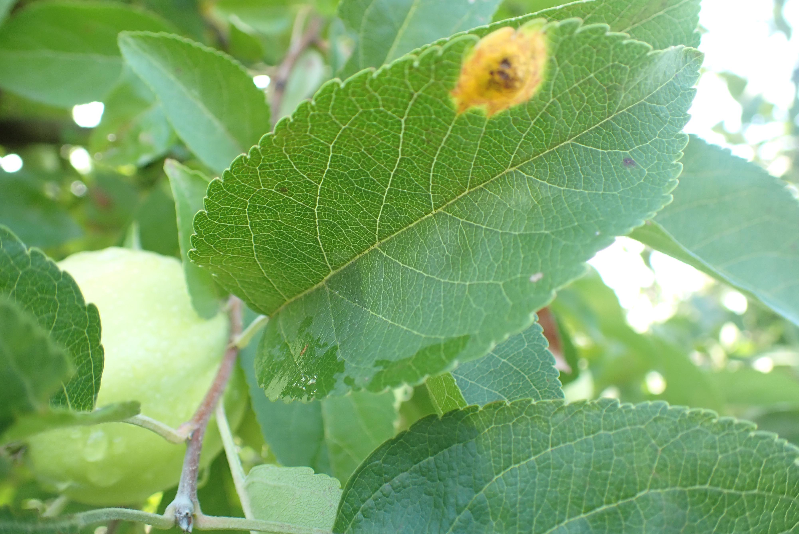
5. complex 复合感染
    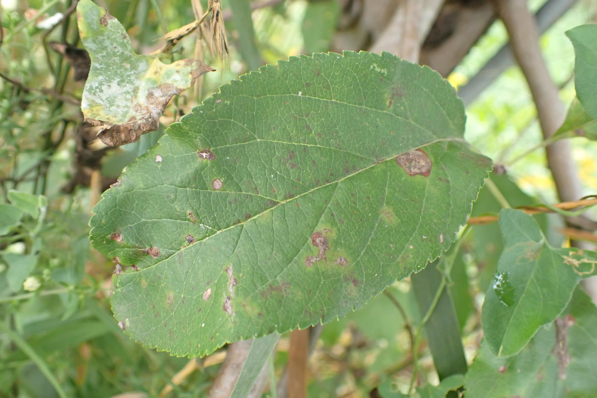
6. frog_eye_lear_spot 蛙眼叶斑病
    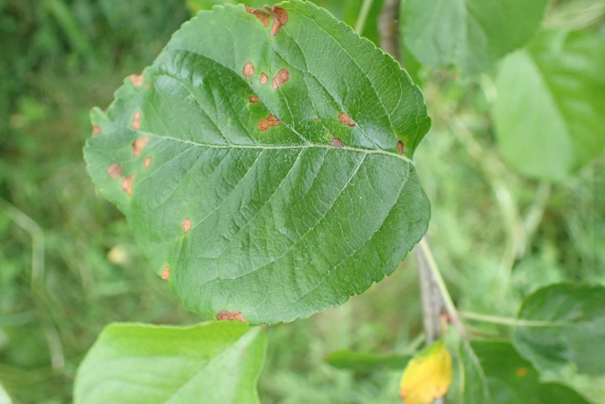

# 要求
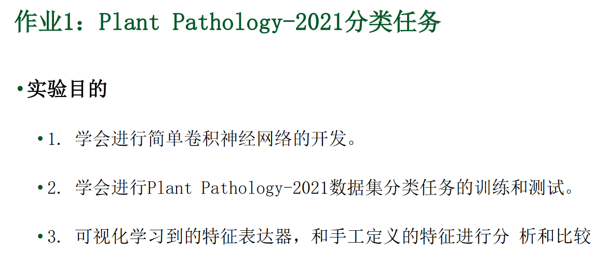
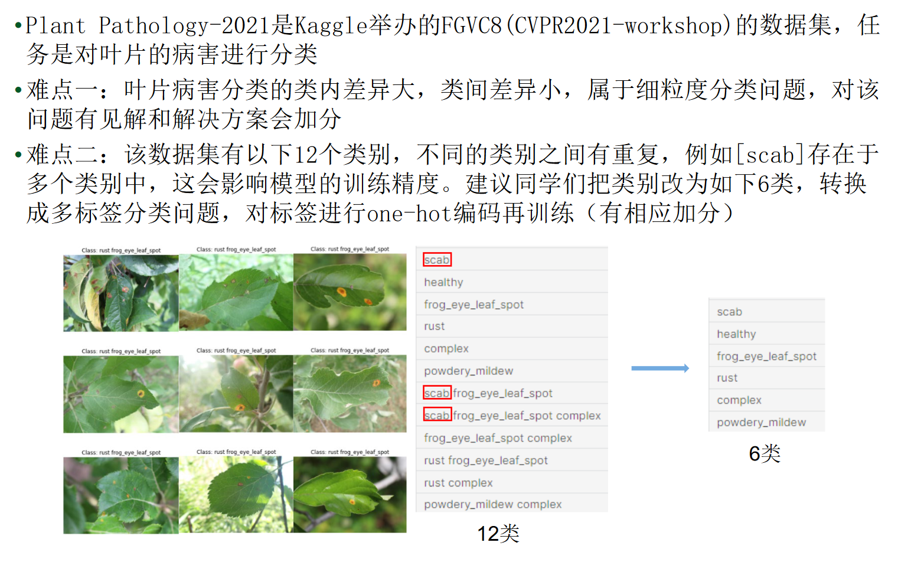
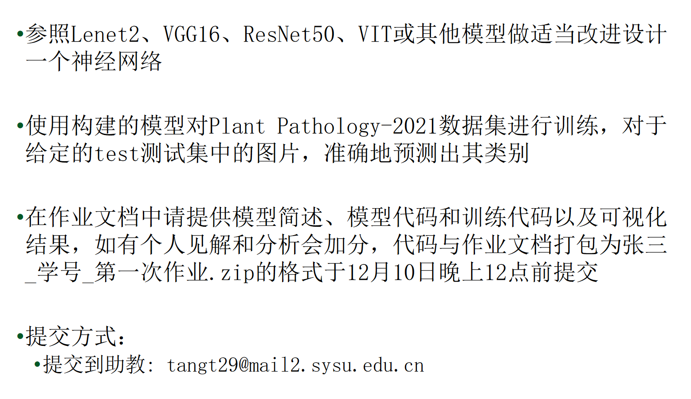
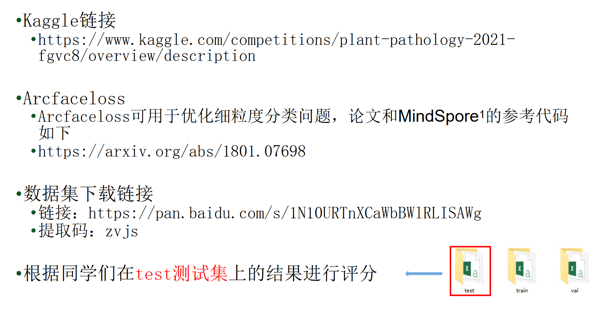
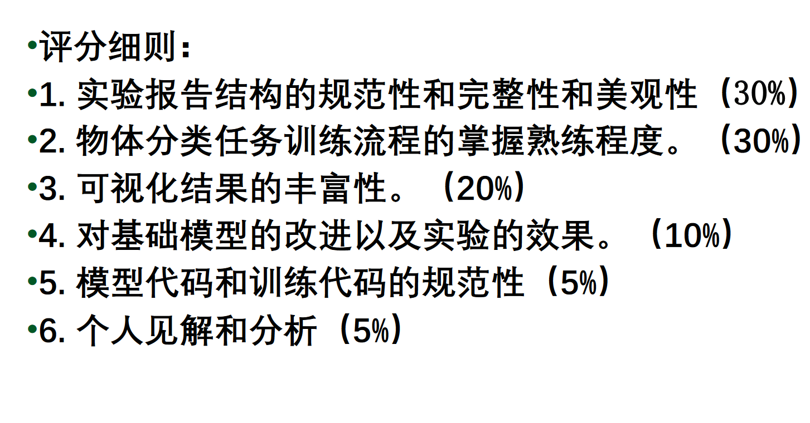

* 数据集百度网盘链接
    * https://pan.baidu.com/s/1N10URTnXCaWbBWlRLISAWg?pwd=zvjs
    
* plant-pathology-2021-fgvc8介绍
    * https://www.kaggle.com/competitions/plant-pathology-2021-fgvc8/overview/description

* 论文参考
    * Arcfaceloss可用于优化细粒度分类问题，论文和MindSpore 1的参考代码
    * https://arxiv.org/abs/1801.07698


# 运行结果
* LeNet5，100 epoch
    
    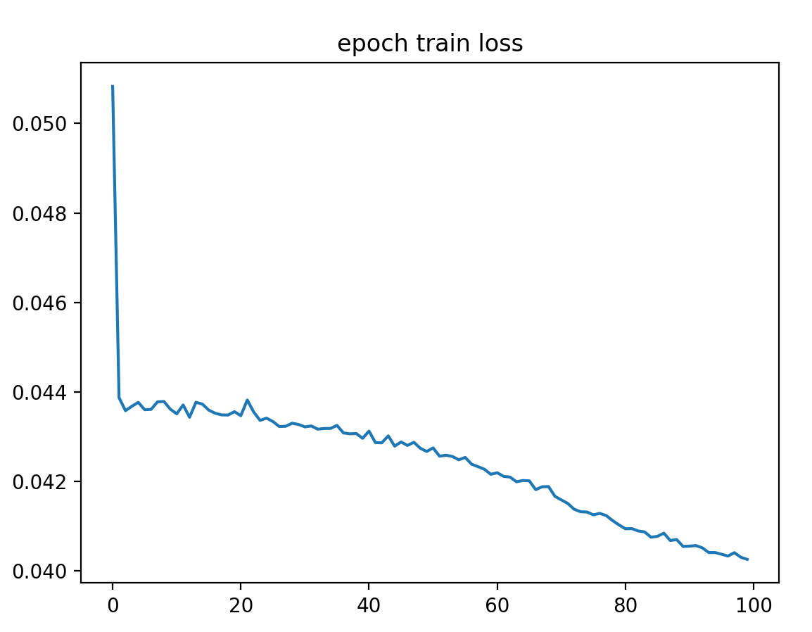


# 模型
1. LeNet
    * [模型介绍](https://blog.csdn.net/qq_43307074/article/details/126022041)
    * [网络介绍](https://blog.csdn.net/muye_IT/article/details/123539199)

2. VGG16
    * [代码参考](https://blog.csdn.net/m0_50127633/article/details/117045008)
    * [网络介绍](https://blog.csdn.net/weixin_45225975/article/details/109220154)
    

# 遇到的问题
## 如何使用GPU
* [教程参考](https://blog.csdn.net/m0_51302496/article/details/138013760)
```shell
 # cuda 版本，查看利用率
nvidia-smi

pip uninstall torch torchvision torchaudio 

# CUDA 11.8
conda install pytorch==2.5.0 torchvision==0.20.0 torchaudio==2.5.0  pytorch-cuda=11.8 -c pytorch -c nvidia 
pip3 install torch torchvision torchaudio --index-url https://download.pytorch.org/whl/cu118
```
