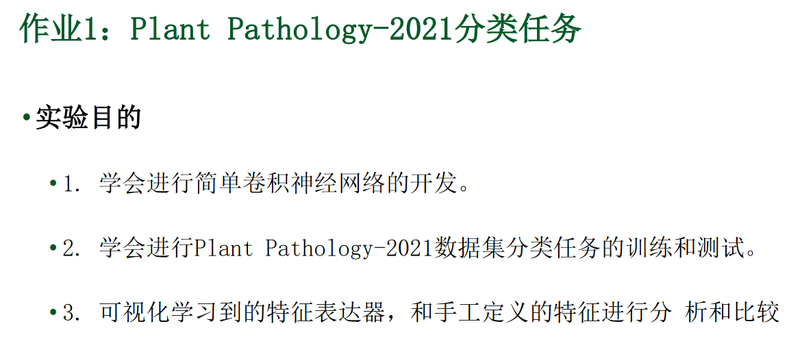
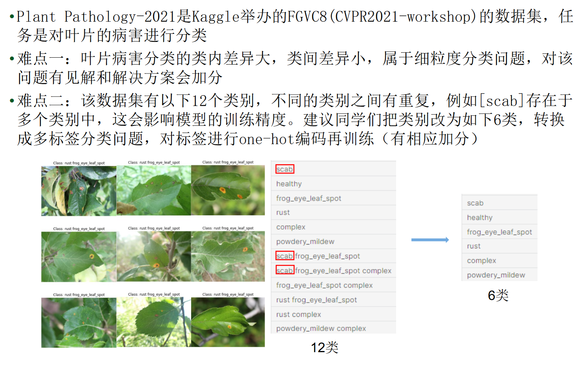
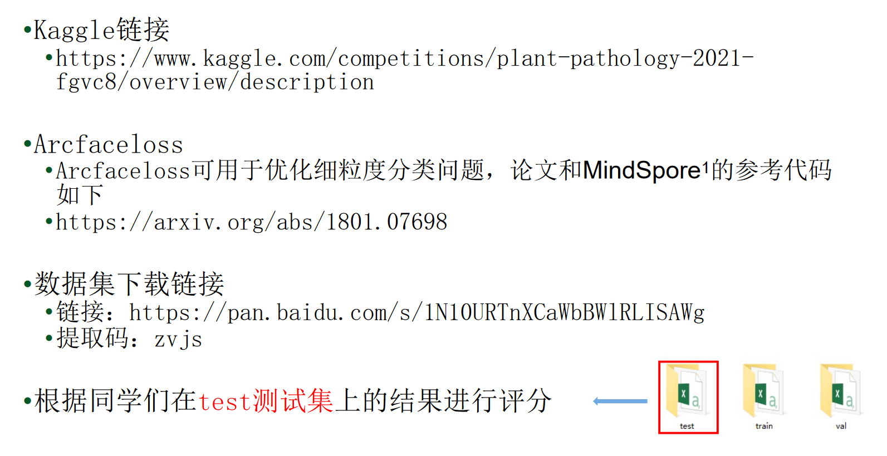
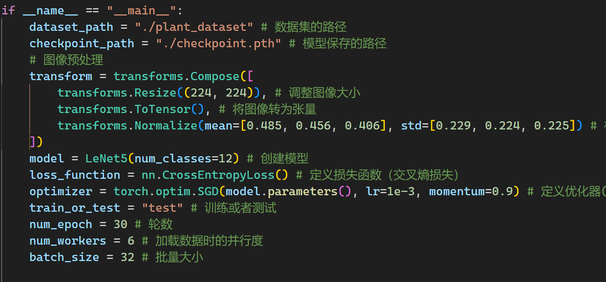

# 还没完成的任务
1. ~~使用one-hot编码~~
2. 可视化训练结果
3. 利用验证集
4. 自动保存模型到model文件夹中，并且保存模型时不会覆盖到其它已经训练好的模型之类的
5. 12类映射成6类，多标签分类问题
6. 检查有没有错误的地方

# 要求






* 数据集百度网盘链接
    * https://pan.baidu.com/s/1N10URTnXCaWbBWlRLISAWg?pwd=zvjs
    
* plant-pathology-2021-fgvc8介绍
    * https://www.kaggle.com/competitions/plant-pathology-2021-fgvc8/overview/description

* 论文参考
    * Arcfaceloss可用于优化细粒度分类问题，论文和MindSpore 1的参考代码
    * https://arxiv.org/abs/1801.07698


# 运行结果
* LeNet5，30 epoch
    * 
    * 
    * 


# 模型
1. LeNet
    * [模型介绍](https://blog.csdn.net/qq_43307074/article/details/126022041)
    * [网络介绍](https://blog.csdn.net/muye_IT/article/details/123539199)

2. VGG16
    * [代码参考](https://blog.csdn.net/m0_50127633/article/details/117045008)
    

# 遇到的问题
## 如何使用GPU
* [教程参考](https://blog.csdn.net/m0_51302496/article/details/138013760)
```shell

nvidia-smi # cuda 版本

pip uninstall torch torchvision torchaudio 


conda install pytorch==2.5.0 torchvision==0.20.0 torchaudio==2.5.0  pytorch-cuda=11.8 -c pytorch -c nvidia # CUDA 11.8
pip3 install torch torchvision torchaudio --index-url https://download.pytorch.org/whl/cu118
```
